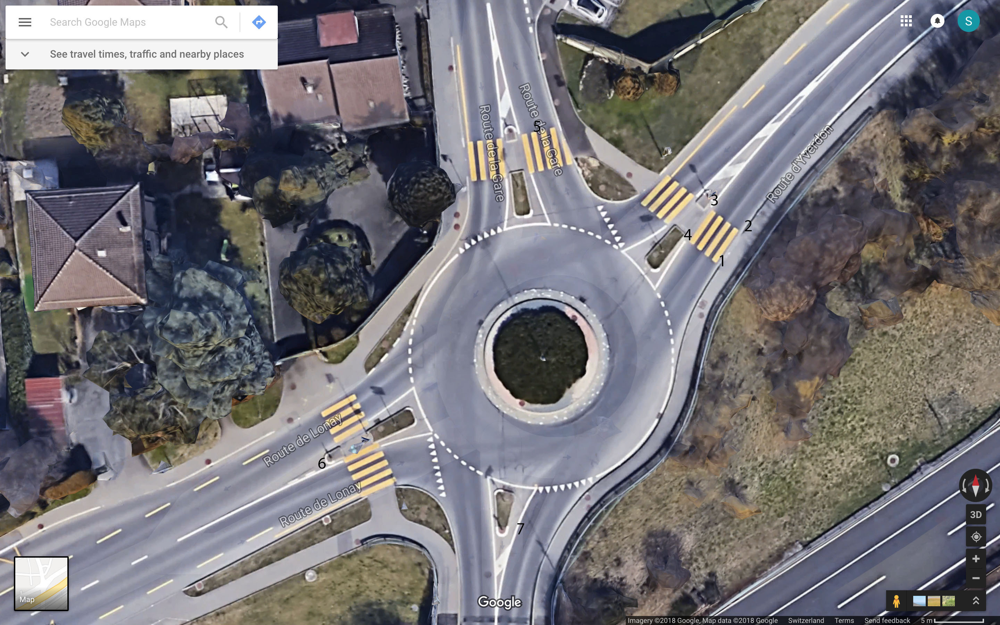
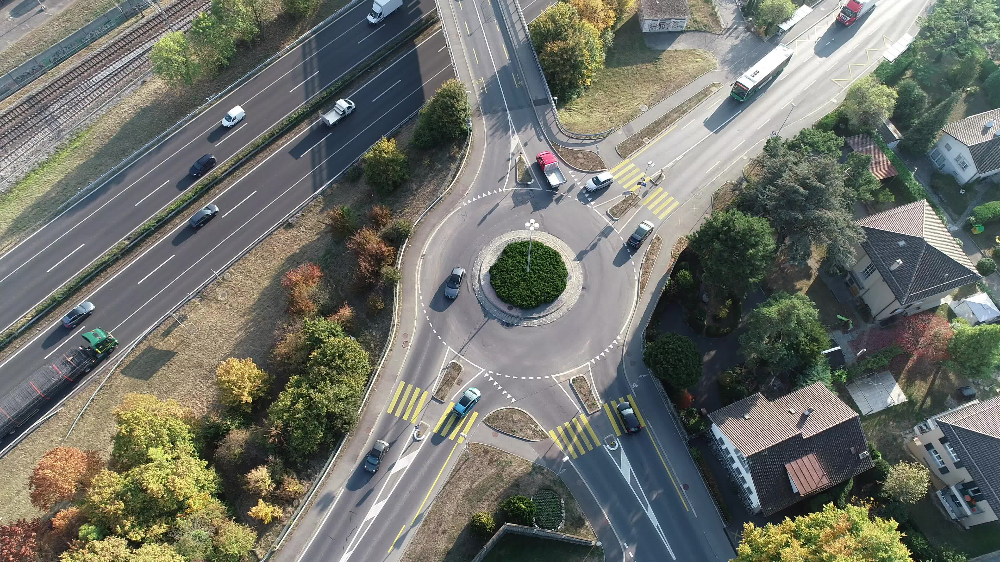
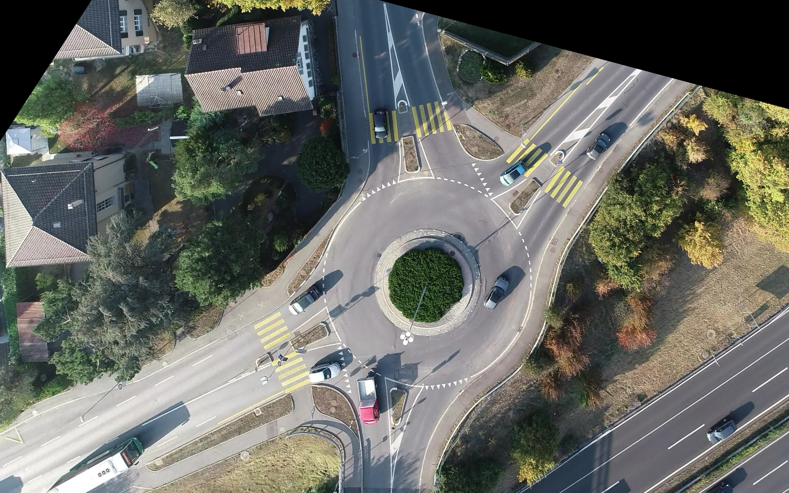
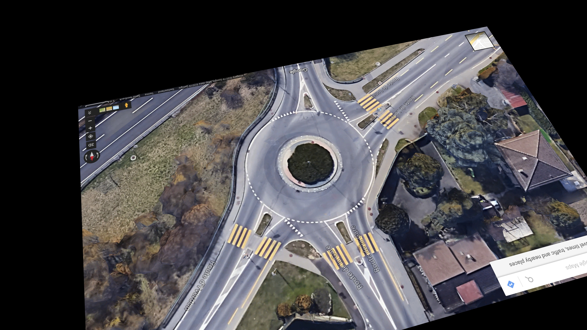

# Homography Meta
```
    ├── README.md                         
    ├── homography_transform.ipynb          : Compute the homography matrix for each scene
    ├── img_coordinates.json                : Metadata of homography transformation
    ├── google_images/                      : Contains google map screenshot of each scene
    ├── video_images/                       : Contains first frame image of each video
    ├── homography_images/                  : Output folder of homography mapping images 
    └── homography_matrix/                  : Output folder of homography matrix
```

# Introduction

**homography_transform.ipynb** computes the homography matrix between google map screenshot and drone video image and save transformed images and matrix into 2-D arrays.


### Example of google map screenshot:


### Example of video image:



### Example of transformed image that is from video's image to google map screenshot:


### Example of transformed image that is from google map screenshot to video's image:

